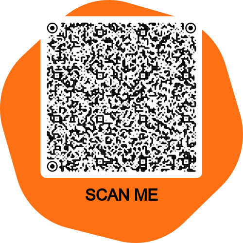

# ClicketteVPN
 

Looking to escape the trackers? Clickette is your #1 solution to stay private online.
## What's included?
Our new VPN has DNS Adblocking for all browsers with no required rooting and is a Central Canadian VPN
## Why switch?
- **Other VPNs track you. ClicketteVPN does not.**
Our VPN makes sure you are not tracked anywhere. It never tracks or logs your IP or location.
- **VPNs are slow.**
Other VPNs make you think you getting the top speed. Our VPN makes sure that you get the fastest speeds.
## Try it!

If we've convinced you to try our VPN, scan this QR code with the WireGuard app.

